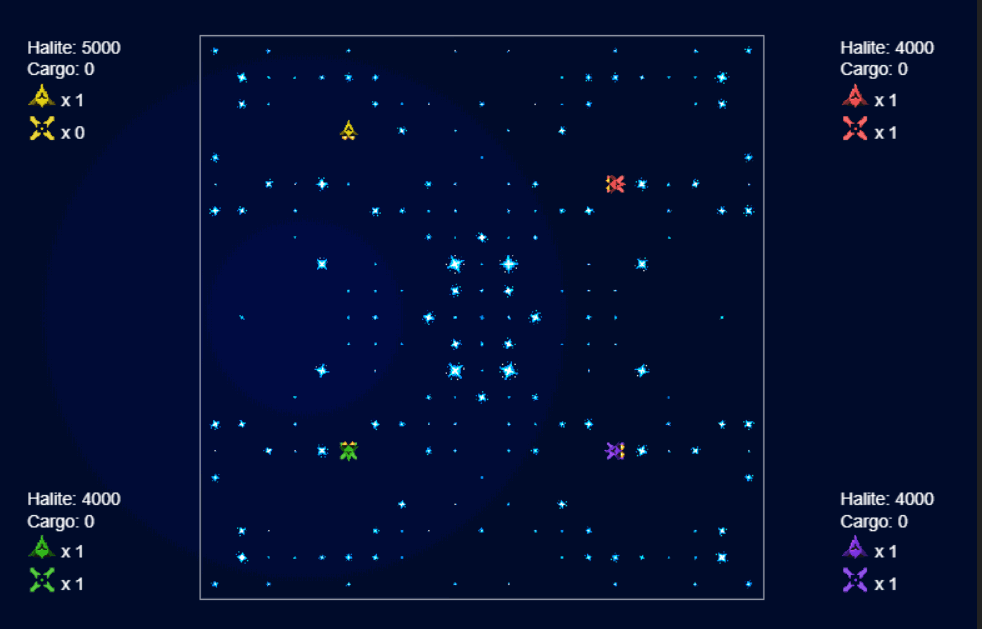
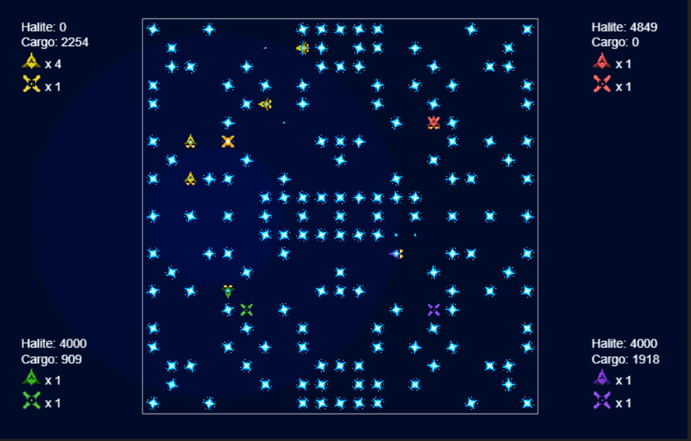

# Halite-Kaggle-Competition
This repo includes a set of tools that can be used to build and train reinforcement learning agents to play [Halite](https://www.kaggle.com/c/halite). The tools included are:
* [A few sample pre-trained reinforcement learning agents](#sample-agents)
* [Commands to run a Docker container to remotely train agents](#running-agents-in-a-docker-container)
* [A reinforcement learning agent class used to interface between the neural net and the Halite SDK](#reinforcement-learning-agent-design)
* [A PyTorch neural net used for estimating the value of a given game state](#neural-net-design)

# Sample agents:
This section includes some of the sample agents trained using the tools in repository, and can serve as a starting point to build better performing agents. All agents were trained against [greedy rule-based agents](https://www.kaggle.com/tmbond/halite-example-agents).  For each sample agent included in this section, a gif containing a snippet from a played game that represents behavior specific to the agent (the yellow team in the gifs) is included. 
## Loading agents
The agents are provided in the [SampleAgents](./SampleAgents) directory, and can be imported using PyTorch's ```torch.load``` function. 

### GreedyTraining

This agent was trained using imitation learning on a greedy rule-based agent for 500 games (i.e. the agent was trained on games of 4 greedy rule-based agents playing against each other). Though imitation learning is typically used for problems with sparse reward signals, and the reward for this environment is not sparse as it is given at the end of each timestep, imitation learning might decrease the training data required to learn behavior that spans many moves (e.g. having ships learn they must visit a shipyard to deposit their cargo). Improvements can be made for this sample agent by using more sophisticated rule-based agents for training. Though this approach ultimately limits the agent's performance to that of the rule based agents it is trained on, it can be used to train a starting agent that can be further optimized using exploratory learning. 

### ExploratoryTrainingGamma=0.1

This agent was trained with a discount factor of 0.1 for 500 games.  This agent was able to learn that both collecting Halite and depositing the cargo back to a shipyard would increase the reward, but was not able to deposit halite to shipyards consistently.
### ExploratoryTrainingGamma=0.8

This agent was trained with a discount factor of 0.8 for 500 games. Though this agent did not learn to bring back halite cargo to a shipyard, it did learn that converting ships that were carrying cargo would still lead to increased rewards.
### ExploratoryTrainingGamma=1.0 

This agent learned to  spawn a lot of ships and shipyards, but this agent performs worse than the above exploratory agents, as the spawned ships tend to crash into each other, and are not able to mine more halite to recover their costs. Intuitively, agents with higher values for ```gamma``` would be better at learning longer-term behavior, as future rewards are discounted less. However, this was not the case here, the agent with the lowest value of gamma learned behavior that optimized for the long term (i.e. depositing halite to shipyards). This failure to learn better long-term behavior might be indicative of overfitting or having too simple of neural net architecture, as the agent could not properly predict when to spawn ships. 

## Expanding on training
The sample agents can be further optimized by using [experience replay](https://towardsdatascience.com/reinforcement-learning-with-hindsight-experience-replay-1fee5704f2f8), implementing [proximal policy optimization](https://openai.com/blog/openai-baselines-ppo/), or testing different discount factors, reward functions, and neural net architectures ([see Neural Net Design section](#neural-net-design)).

In addition to changing hyperparameters, there is room for exploring a single-agent approach where each ship and shipyard act as individual agents. A single-agent approach would employ two separate neural nets - one for ships and one for shipyards. Each ship/shipyard would convert the global game state to a local state using a coordinate system that centers the gamepiece on the game grid (which can be done, as the game map wraps around itself as if it were a sphere). This local state can then be passed as an input for the corresponding ship/shipyard neural net. In addition to providing a meaningful pre-processing step, a single-agent approach would draw more value out of training data, as each ship would produce a separate local episode for each training game it plays, as opposed to the multi-agent case, where only a single global episode is produced per each game. 


# Running agents in a Docker Container
The  agent can be trained using Jupyter Notebooks hosted on a remote machine using the ```haliterltraining``` docker container, which contains an installation of PyTorch, kaggle-environments, and Jupyter Notebooks. The container can be imported by running  ```docker pull rnksngh/haliterltraining``` from the command line. The notebook can be run through the command line using ```docker run -p 8888:8888 rnksngh/haliterltraining```. Once the notebook is running, the agent can be trained using the ```local_halite_sdk.ipynb``` file in the Docker container. 

# Reinforcement Learning Agent Design
The ```RL_Agent.py``` file uses the neural net in the ```Halite_Neural_Net.py``` file to estimate the value of each state. The agent chooses its next move by iterating through all game pieces (ships and shipyards), calculating the value from the state that would result for each possible move for each game piece, and returning the move which would produce the best state for each game piece. The ```rl_agent``` class also contains a variable for keeping track of which moves were exploratory moves, which is used during the training process. 

# Neural Net Design: 
 The neural net can be trained after a played game using the ```update_values``` and ```rule_update_values``` methods from the  ```Halite_Neural_Net.py``` file. 
## Neural Net Input
The ```convert_inputs``` function in the ```Halite_Neural_Net.py``` file converts an observation given by the Halite SDK to a 21x21x4 tensor that can be passed as an input to the neural net. The tensor represents 4 channels for each location in the 21x21 game grid: 
1. The first channel contains the amount of halite available at a coordinate.
1. The second channel contains the indices of the team that each shipyard belongs to. A coordinate with a team index of 1 indicates a shipyard belonging to the agent's team. A coordinate with a team index between 2-4 indicates a shipyard belonging to an enemy team. A coordinate with a value of 0 indicates there is no shipyard at the coordinate.
1. The third channel contains the indices of the team that each ship belongs to, similar to the team indexing for the second channel. 
1. The fourth channel contains the amount of halite being carried by each ship at a coordinate. 

## Reward function
The reward function is calculated for a game state in the ```update_values``` method in the ```Halite_Neural_Net.py``` file. The current reward function is the difference between the agent's score and the highest of the opponents scores. This framing of the reward function was done to include possible pirate strategies, which might lower the absolute scores of all players while still increasing the agent's score with respect to the opponents' scores.  This reward function can be augmented with some metric of including the halite stored on the agent's ships, though this would also bring challenges in ensuring the agent is still incentivized to bring cargo back to shipyards to increment the score. 

## Changing Hyperparameters
The values for gamma can be changed in the  ```update_values()``` and  ```rule_update_values()``` function calls in the ```Halite_SDK_Interface.py``` file. The neural net architecture and hyperparameters can be changed in the ```Halite_Neural_Net.py``` file. 

## Saving Neural Net Parameters
Once trained, PyTorch agents are saved in the ```Halite_SDK_Interface.py``` file using the ```torch.save``` method. The saved files can be loaded using the ```torch.load``` method. 
